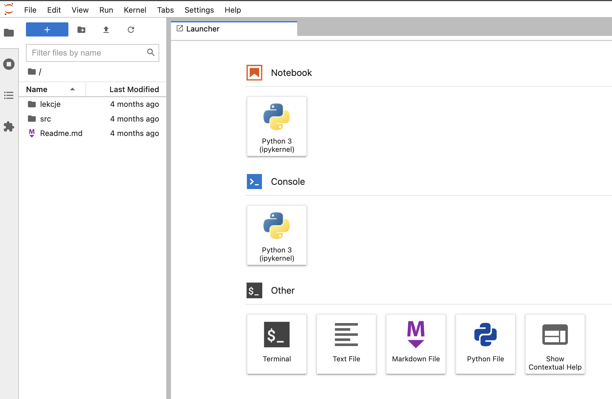
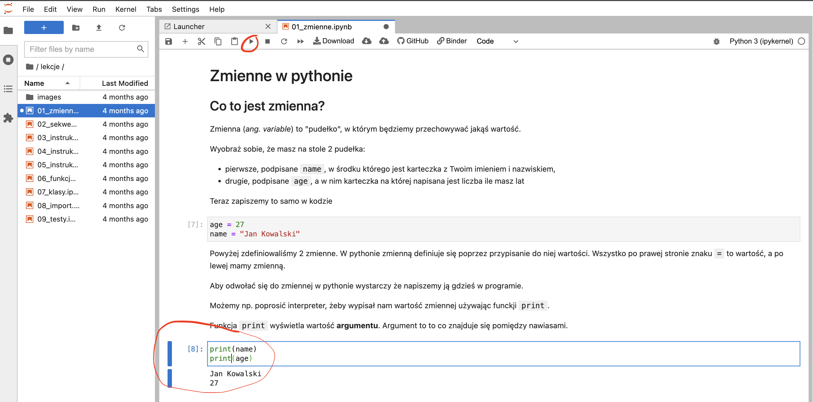

# Python - tutorial dla początkujących.
Poniżej znajdziesz serię lekcji programowania dla początkujących w języku python. 

Tutorial jest przygotowany w taki sposób, abyś mógł go uruchamiać bez instalacji na swoim komputerze - wystarczy że wejdziesz na stronę: https://mybinder.org/v2/gh/OlgaPaw/python_tutorial/main i poczekasz na uruchomienie - zostanie dla Ciebie utworzone środowisko, w którym będziesz mógł się uczyć uruchamiając kod z lekcji.

Po uruchomieniu projektu zostaniesz przekierowany na następującą stronę: 

Na pasku z lewej strony wybierz z katalogu lekcje interesującą Cię lekcję.

Kod w lekcjach jest interaktyny. 

Aby uruchomić kliknij myszą w pole z kodem a następnie w przycisk Run (lub `ctrl + enter` na klawiaturze).

Każda lekcja ma zadania. Edytuj interaktywny kod i uruchom po swoich zmianach.

## Rozwiązywanie problemów

### Kod się nie uruchamia

Sprawdź, czy kod coś wypisuje, np, w pierwszej linii dodaj `print('test')` i uruchom ponownie. 
- Jeśli wyświetliło się `test` to prawdopodobnie twój kod nic nie wyświetla, ale działa poprawnie. Spróbuj wyświetlić którąś ze zmiennych używając `print(zmienna)`
- Jeśli `test` nie wyświetliło się pod kodem, prawdopodobnie należy wybrać lub zrestartować pythona.
    - Jeśli python jest nieaktywny, w prawym górym rogu zobaczysz napis "No kernel". Kliknij w ten napis i wybierz `python 3 (ipykernel)`.
    - Jeśli w prawym górym rogi widzisz napis  `python 3 (ipykernel)`, a pomimo to nie możesz uruchomić kodu, wybierz z menu aplikacji `Kernel` a następnie `Restart kernel`.

Jeśli powyższe sposoby zawiodły, wróć otwórz ponownie aplikację używając linku z sekcji Jak uruchomić.

Jeśli nadal nie działa - zgłoś problem w zakładce Issues

## Praktyczne wskazówki dla początkujących.
W katalogu [praktyczne_wskazowki](praktyczne_wskazowki) znajdziesz kilka porad, które pomogą Ci szybciej wejść na programistyczną drogę - m.in. narzędzia powszechnie używane w pracy z pythonem. 